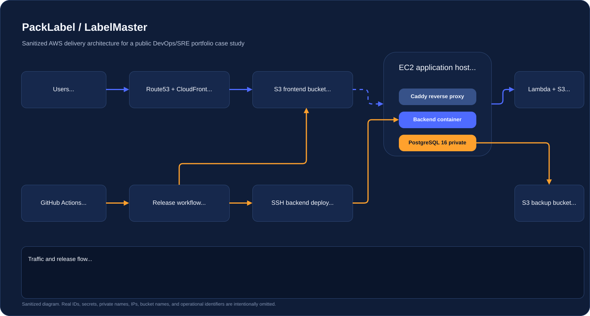

# LabelMaster / Potaglab

<section class="hero-panel">
  

    
Sanitized AWS / DevOps / SRE portfolio case study

    <h1>Production delivery story for a logistics labeling platform</h1>
    

      This repository documents how I packaged, delivered, and operated a private business application on AWS
      without publishing proprietary code. The focus is on release engineering, infrastructure shape, database
      operations, security boundaries, and day-two operability.
    

    

      AWS
      S3 + CloudFront
      EC2 + Docker Compose
      Caddy
      PostgreSQL 16
      GitHub Actions
    

    

      <a class="hero-button hero-button-primary" href="architecture/">Explore Architecture</a>
      <a class="hero-button hero-button-secondary" href="cicd/">Review CI/CD</a>
      <a class="hero-button hero-button-secondary" href="https://potaglab.com">Open potaglab.com</a>
    

  

  

    

      <strong>Public repo</strong>
      Sanitized and portfolio-safe
    

    

      <strong>Private app code</strong>
      Deliberately excluded
    

    

      <strong>Primary focus</strong>
      Infrastructure, delivery, operations
    

  

</section>

## What This Repository Shows

The application itself solves a practical logistics workflow: importing structured data, managing shipments, generating pallet and box layouts, and exporting labels. For portfolio purposes, I kept the emphasis on the infrastructure and delivery layer around that product. The interesting part here is not a toy demo, but how the system is exposed safely on the Internet, how releases are gated, how PostgreSQL is handled, and how the runtime can be operated without pretending the platform is larger than it is.

This is also why the repository is intentionally sanitized. The real codebase, real AWS identifiers, secrets, customer data, and business-specific naming stay private. What remains public is the part that is still useful in an engineering conversation: architecture, deployment patterns, operational trade-offs, and the artifacts that support them.

## Engineering Highlights

  <article class="feature-card">
    <h3>Static delivery at the edge</h3>
    
The frontend is built once, uploaded to S3 with cache-aware rules, and served through CloudFront with SPA fallback behavior.

  </article>
  <article class="feature-card">
    <h3>Small runtime, clear boundaries</h3>
    
The API runs on EC2 behind Caddy, while PostgreSQL stays private on the same host in Docker Compose to keep the topology simple and understandable.

  </article>
  <article class="feature-card">
    <h3>Controlled release flow</h3>
    
GitHub Actions separates linting, build, migration, and deploy stages instead of hiding everything behind a single push-to-prod pipeline.

  </article>
  <article class="feature-card">
    <h3>Migration discipline</h3>
    
Schema changes are treated as an explicit stage so deployment risk stays visible and rollback decisions are made deliberately.

  </article>
  <article class="feature-card">
    <h3>Backups and restore thinking</h3>
    
The database section documents logical dumps, object storage retention, and restore validation instead of stopping at “we have backups”.

  </article>
  <article class="feature-card">
    <h3>Public-safe documentation</h3>
    
The repo is structured to look like a real platform portfolio without leaking secrets, real identifiers, or private source code.

  </article>

## Documentation Map

  <a class="quick-nav-card" href="architecture/"><strong>Architecture</strong>System shape, traffic paths, design rationale</a>
  <a class="quick-nav-card" href="cicd/"><strong>CI/CD</strong>Release gates, quality checks, deploy stages</a>
  <a class="quick-nav-card" href="aws-infrastructure/"><strong>AWS Infrastructure</strong>S3, CloudFront, Route53, EC2, IAM, backups</a>
  <a class="quick-nav-card" href="database/"><strong>Database</strong>PostgreSQL 16, migrations, backups, restore path</a>
  <a class="quick-nav-card" href="security/"><strong>Security</strong>Sanitization, auth boundaries, hardening posture</a>
  <a class="quick-nav-card" href="sre-operability/"><strong>SRE / Operability</strong>Health checks, rollback, logging, incident handling</a>
  <a class="quick-nav-card" href="roadmap/"><strong>Roadmap</strong>Next maturity steps for platform and portfolio</a>

## Why It Matters

For a portfolio, I wanted something more credible than a checklist of tools. This case study shows a deployment model that is small enough to reason about, but real enough to discuss production concerns: blast radius, TLS termination, database exposure, release gates, manual intervention points, backup boundaries, and what I would improve next if the platform kept growing.
