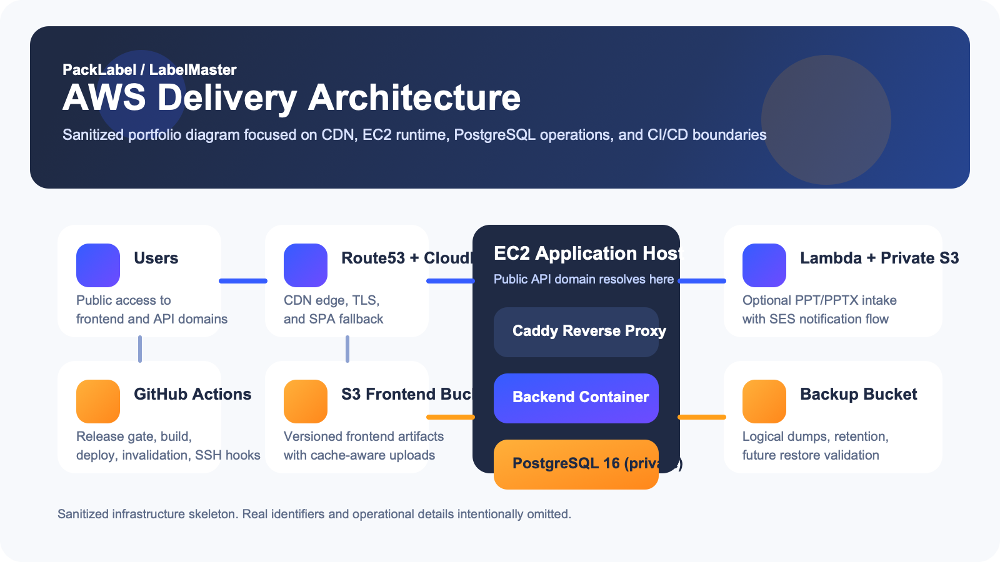

# PackLabel / LabelMaster

  
Sanitized AWS / DevOps / SRE Case Study

  <h1>Production delivery case study for a logistics labeling platform</h1>
  

    Public-safe portfolio repository focused on AWS architecture, release engineering,
    PostgreSQL operations, and platform hardening. Proprietary source code is intentionally excluded.
  

  

    <a class="hero-button hero-button-primary" href="architecture/">View Architecture</a>
    <a class="hero-button hero-button-secondary" href="cicd/">Review CI/CD</a>
  

## Scope

- Private commercial app, public engineering case study
- Real deployment model documented with placeholders only
- Focus on AWS delivery, deployment boundaries, database operations, and SRE roadmap

## Product Snapshot

- Excel import for product and shipment workflows
- Product and shipment management
- Pallet and box layout logic
- PDF / PPTX label export
- JWT-based authenticated application flow

## Engineering Highlights

  

    <h3>Edge Delivery</h3>
    
S3 + CloudFront for static frontend hosting with SPA fallback and cache-aware deploys.

  

  

    <h3>Runtime</h3>
    
EC2 host running Caddy, backend container, and private PostgreSQL 16 in Docker Compose.

  

  

    <h3>Release Control</h3>
    
Release branch merge gate, manual dispatch toggles, staged migrations, and versioned frontend artifacts.

  

  

    <h3>Security</h3>
    
No public DB port, TLS on app and API, least-privilege deploy access, and no secrets in repo.

  

## Documentation Map

- [Architecture](architecture.md)
- [CI/CD](cicd.md)
- [AWS Infrastructure](aws-infrastructure.md)
- [Database](database.md)
- [Security](security.md)
- [SRE / Operability](sre-operability.md)
- [Screenshots](screenshots.md)
- [Roadmap](roadmap.md)

## Public-Safe Positioning

This repository demonstrates platform engineering and operational design, not proprietary business logic. It is suitable for portfolio review, architecture discussion, and DevOps/SRE interviews.
