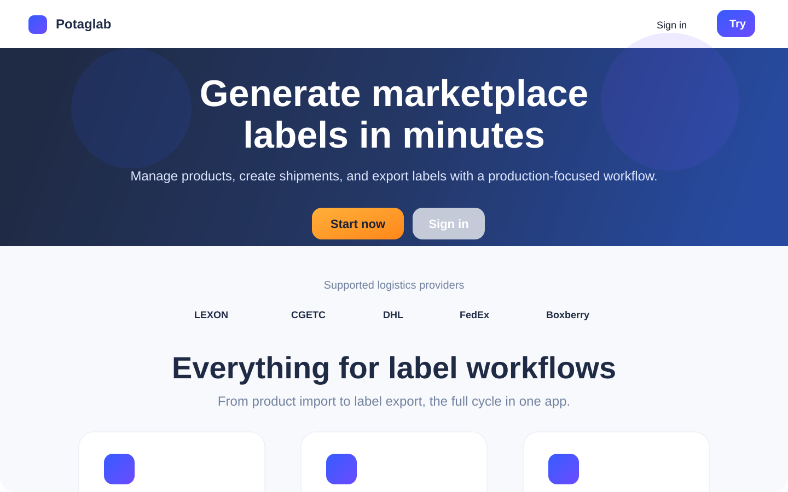

# Screenshots

## Public-Safe Visuals

The original product uses a deep navy, electric blue, and accent orange visual language. For this portfolio repository, visuals are either redacted or reconstructed to avoid exposing internal UI details unnecessarily.

### Landing / product style reference

## Recommended Screenshot Set For Publication

When you prepare the final public GitHub repository, use 4-6 carefully redacted screenshots:

1. Landing page hero
2. Product management screen with blurred business data
3. Shipment workflow or pallet layout screen with dummy data
4. Export or label generation screen
5. AWS / CI/CD architecture slide or diagram

## Redaction Rules

- Remove customer names
- Remove SKUs or order IDs if they are real
- Remove email addresses, tokens, URLs, and internal notes
- Crop browser chrome if it reveals internal environments
- Prefer demo or fabricated data where possible
